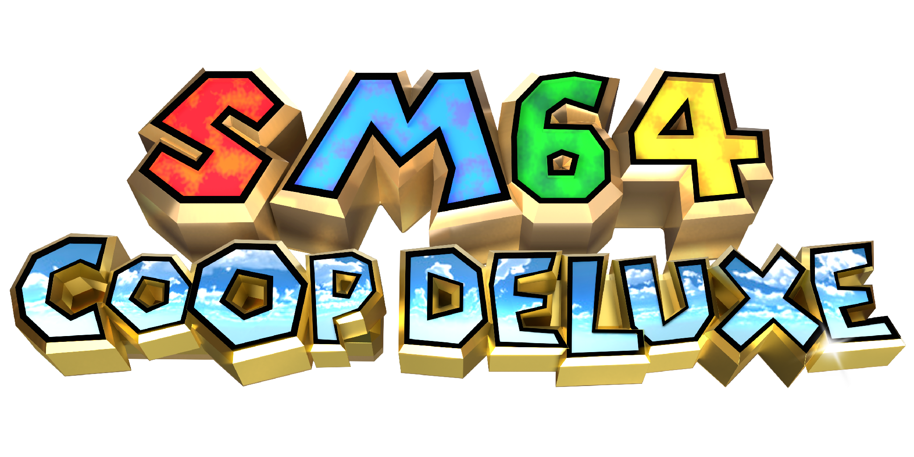

# sm64coopdx

sm64coopdx is an online multiplayer project for the Super Mario 64 PC port that synchronizes all entities and every level for multiple players. The project was started by the Coop Deluxe Team. The purpose is to actively maintain and improve, but also continue sm64ex-coop, created by djoslin0. More features, customization, and power to the Lua API allow modders and players to enjoy Super Mario 64 more than ever!

Feel free to report bugs or contribute to the project.

## Play in Your Browser

**[Play sm64coopdx on the Web](https://zalo.github.io/sm64coopdx/)** — no downloads or installation required.

The web port runs natively in your browser using WebAssembly. Provide a Super Mario 64 US ROM on your first visit (it's cached locally for future sessions), then play solo or with friends via peer-to-peer multiplayer. Works on desktop and mobile (iOS and Android).

### Web Multiplayer

Multiplayer uses PeerJS (WebRTC) for direct peer-to-peer connections — no central game server required.

1. Click **Play** from the main menu
2. Configure your mods and settings, then enter a **Room ID**
3. Share the same Room ID with friends
4. The first player to join becomes the host; others connect automatically

You can also share a direct link with `?room=YourRoomName` appended to the URL to let friends join with one click.

### Web Features

- **Peer-to-peer multiplayer** via WebRTC (PeerJS) — no server setup needed
- **Mod support** — built-in mods (arena, character-select, sm74, star-road, etc.) are preloaded; upload additional `.lua` or `.zip` mods through the in-game Mod Manager
- **Persistent settings** — mod selections, host settings, save files, and ROM are cached in your browser across sessions
- **Mobile support** — on-screen touch controls for phones and tablets
- **URL parameters** — `?room=NAME` for auto-join/host, `?join=HOST:PORT` and `?host=PORT` for direct WebSocket connections

### Building the Web Port

Prerequisites: [Emscripten SDK](https://emscripten.org/docs/getting_started/downloads.html) installed at `~/emsdk` or `/usr/local/emsdk`.

```bash
# Build (incremental, debug)
./build_web.sh

# Clean build
./build_web.sh clean

# Serve locally (game at http://localhost:8083/sm64coopdx.html)
./serve.sh
```

The build compiles to WebAssembly with Emscripten, using SDL2 for input/windowing and OpenGL ES 2.0 (WebGL) for rendering. A WebSocket-to-UDP proxy (`src/pc/web/proxy/proxy.js`) is also available for bridging browser clients to native game servers.

## Initial Goal (Accomplished)
Create a mod for the PC port where multiple people can play together online.

Unlike previous multiplayer projects, this one synchronizes enemies and events. This allows players to interact with the same world at the same time.

Interestingly enough though, the goal of the project has slowly evolved over time from simply just making a Super Mario 64 multiplayer mod to constantly maintaining and improving the project (notably the Lua API.)

## Lua
sm64coopdx is moddable via Lua, similar to Roblox and Garry's Mod's Lua APIs. To get started, click [here](docs/lua/lua.md) to see the Lua documentation.

## Wiki
The wiki is made using GitHub's wiki feature, you can go to the wiki tab or click [here](https://github.com/coop-deluxe/sm64coopdx/wiki).
