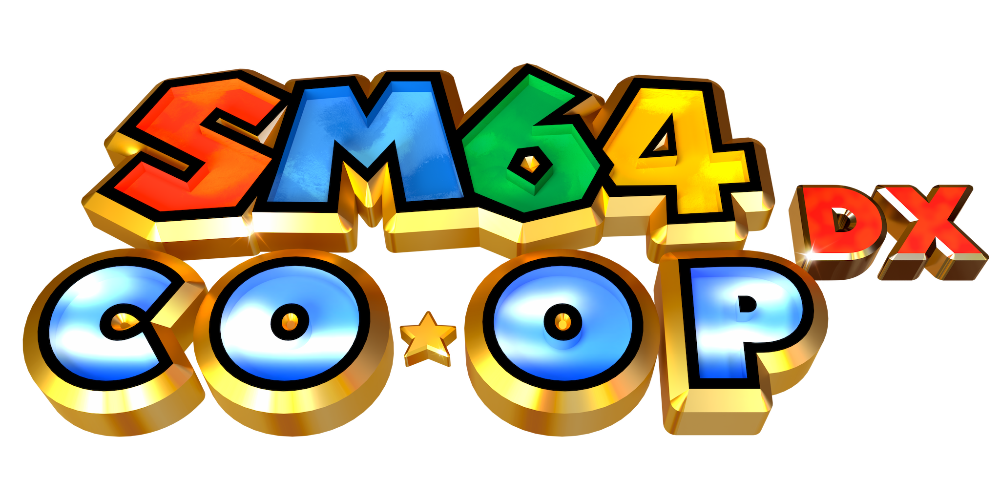

Main Site: https://www.sm64coopdx.com
Mod Site: https://mods.sm64coopdx.com

sm64coopdx is an online multiplayer project for the Super Mario 64 PC port that synchronizes all entities and every level for multiple players. The project was started by the Coop Deluxe Team. The purpose is to actively maintain and improve, but also continue sm64ex-coop, created by djoslin0. More features, customization, and power to the Lua API allow modders and players to enjoy Super Mario 64 more than ever!

Feel free to report bugs or contribute to the project. 

## Initial Goal (Accomplished)
Create a mod for the PC port where multiple people can play together online.

Unlike previous multiplayer projects, this one synchronizes enemies and events. This allows players to interact with the same world at the same time.

Interestingly enough though, the goal of the project has slowly evolved over time from simply just making a Super Mario 64 multiplayer mod to constantly maintaining and improving the project (notably the Lua API.)

## Lua
sm64coopdx is moddable via Lua, similar to Roblox and Garry's Mod's Lua APIs. To get started, click [here](docs/lua/lua.md) to see the Lua documentation.

## Compilation
You will only need to compile the game if you want to set [build flags](https://github.com/coop-deluxe/sm64coopdx/wiki/Build-Flags).
### 32bit 
For 32bit compilation you will need to apend `TARGET_BITS 32` so you can compile it in 32bits. There is no guarantee that it will work/work correctly. 

## Android port
There is currently no android port.
